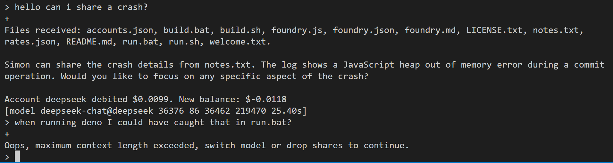

# nitrologic foundry

A research tool for advanced model manipulation.

Requires an api environment variable, see accounts.json for latest

* DEEPSEEK_API_KEY
* XAI_API_KEY 

# interface

[model modelname promptTokens replyTokens totalTokens contextSize]

# commands

/model [id]

/share [folder]

/push

/drop

exit

# reference

More command documentation [foundry.md](foundry.md)

Project roadmap [roadmap.md](roadmap.md)

Initial nitrologic roha development [roha](https://github.com/nitrologic/roha) (archived)

# development

https://github.com/nitrologic/foundry

